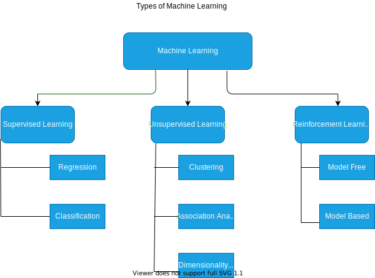

# Machine Learning

Table of Contents
=================

   * [Machine Learning](#machine-learning)
      * [History](#history)
      * [Time Line of Machine Learning History](#time-line-of-machine-learning-history)
      * [Definition](#definition)
      * [Types of Machine Learning](#types-of-machine-learning)
         * [Supervised machine learning](#supervised-machine-learning)
            * [Examples](#examples)
         * [Unsupervised machine learning](#unsupervised-machine-learning)
         * [Reinforcement machine learning](#reinforcement-machine-learning)
      * [Other Machine learning Algorithms](#other-machine-learning-algorithms)
         * [Nearest Neighbour Classification](#nearest-neighbour-classification)
   * [Linear Regression](#linear-regression)
      * [Least-Squares Regression](#least-squares-regression)
         * [Explanation](#explanation)
   * [What is Artificial Intelligence (AI)?](#what-is-artificial-intelligence-ai)
      * [Applications of Artificial Intelligence](#applications-of-artificial-intelligence)
      * [Types of Artificial Intelligence](#types-of-artificial-intelligence)
         * [Artificial Narrow Intelligence (ANI) or Weak AI](#artificial-narrow-intelligence-ani-or-weak-ai)
         * [Artificial General Intelligence](#artificial-general-intelligence)
   * [Current Uses of AI:](#current-uses-of-ai)
      * [Email filtering:](#email-filtering)
      * [Personalization:](#personalization)
      * [Fraud detection:](#fraud-detection)
      * [Speech recognition:](#speech-recognition)
   * [What is Data in machine learning?](#what-is-data-in-machine-learning)
   * [Data Science VS Machine Learning](#data-science-vs-machine-learning)
      * [Example of ML vs DS in the online ad industry](#example-of-ml-vs-ds-in-the-online-ad-industry)
      * [Data Science](#data-science)
      * [Artificial Intelligence](#artificial-intelligence)
      * [Machine Learning](#machine-learning-1)
      * [Deep Learning](#deep-learning)
      * [How artificial Intelligence will transform Business](#how-artificial-intelligence-will-transform-business)
      * [The future of Artificial Intelligence](#the-future-of-artificial-intelligence)
      * [What does Artificial Intelligence mean for the worker?](#what-does-artificial-intelligence-mean-for-the-worker)
   * [What makes a Company an AI Comapny?](#what-makes-a-company-an-ai-comapny)
      * [1. Strategic Data Acquisition](#1-strategic-data-acquisition)
         * [The value of data](#the-value-of-data)
            * [1) Cost-based approach:](#1-cost-based-approach)
            * [2) Market-based approach:](#2-market-based-approach)
            * [3) Income-based approach:](#3-income-based-approach)
         * [13 Dimensions for Evaluating Strategic Data Acquisition](#13-dimensions-for-evaluating-strategic-data-acquisition)
      * [Unified Dataware House](#unified-dataware-house)
      * [Pervasive Automation](#pervasive-automation)

## History
In 1642, one of the first mechanical adding machine was designed by **Blaise Pascal**. It used a system of gears and wheels similar to those found in odometers and other counting devices. Pascal's adder also known as **Pascaline**, could both add and subtract and was invented to calculate taxes.

In 1694 **Gottfried Wilhelm Von Lebniez** produced a similar machine to that of **Pascaline**, that was more accurate and could perform all four arithematic functions. Lebneiz also created **binary system** used by all modern computers. 

**Storing data** was the next challenge to be met. In 1801 the first use of storing data was in a weaving loom invented by **Joseph Marie Jacquard** that used metal cards punched with holes to position threads. A collection of these cards coded a program that directed the loom. This allowed for a process to be repeated with a consistent result every time.

In 1847, **George Boole** created a way of representing this using **Boolean operators (AND, OR, NOR)** and having responses represented by true or false, yes or no, and represented in binary as 1 or 0. Web searches still use these operators today.

In **1890 Herman Hollerith** created the first combined system of mechanical calculation and punch cards to rapidly calculate statistics gathered from millions of people.

In 1945 **Mark I** built at **IBM** and designed by **Howard Aiken**, was the first combined electric and mechanical computer. The **Mark I** could **store 72 numbers** and it could perform complex multiplication in 6 seconds and division in 16.

In 1946 the first **fully electronic computer** was built by **John Mauchly** and **John Eckert** and named **ENIAC**, short for *Electronic Numerical Integrator and Computer*.

In 1952 **Arthur Samuel** was an **IBM** scientist who used the game of **checkers** to create the **first learning program**. His program became a better player after many games against itself and a variety of human players in a **'supervised learning mode'**. The program observed which moves were winning strategies and adapted its programming to incorporate those strategies. 

In 1957 **Frank Rosenblatt** designed the perceptron which is a type of *neural network*. A neural network acts like your brain; the brain contains billions of cells called neurons that are connected together in a network. The perceptron connects a web of points where simple decisions are made that come together in the larger program to solve more complex problems.
In 1967 the first **pattern regonition program** were designed based on a type of algorithm called the *nearest neighbour*. An algorithm is a sequence of instructions and steps. When the program is given a new object it compares this with data from the training set and classifies the object to the *nearest neighbour*, or most similar object in memory.

In 1981 **Gerald Dejong** introduced *explanation based learning*, prior knowledge of the world is provided by training examples which makes this a type of supervised learning. The program analyzes the training data and discards irrelevant information to form a general rule to follow. For example in chess if the program is told that it needs to focus on the queen, it will discard all piesces that don't have immediate effect upon her.

In 1990's Machine learning applications in *data mining, adaptive software and web applications, text learning , and language learning* were started. Advances continued in machine learning algorithms within the general areas of supervised learning and unsupervised learning. As well, reinforcement learning algorithms were developed.

In 2000's the new millenium brought an explosion of *adaptive programming*. Anywhere adaptive programs are needed, machine learning  is there. These programs are capable of recognizihng patterns, learning from experience, abstracting new information from data, and optimizing the efficiency and accuracy of its processing and output.

## Time Line of Machine Learning History 

## Definition

Machine learning is an application of artificial intelligence (AI) that provides systems the ability to automatically learn and improve from experience without being explicitly programmed. Machine learning focuses on the development of computer programs that can access data and use it to learn for themselves.
"Machine learning is defined as field of study that gives computers the ability to learn without being explicitly programmed"- Arthur Samauel
“Machine Learning at its most basic is the practice of using algorithms to parse data, learn from it, and then make a determination or prediction about something in the world.” – Nvidia 
“Machine learning is the science of getting computers to act without being explicitly programmed.” – Stanford
“Machine learning is based on algorithms that can learn from data without relying on rules-based programming.”- McKinsey & Co.
“Machine learning algorithms can figure out how to perform important tasks by generalizing from examples.” – University of Washington
“The field of Machine Learning seeks to answer the question “How can we build computer systems that automatically improve with experience, and what are the fundamental laws that govern all learning processes?” – Carnegie Mellon University

## Types of Machine Learning

### Supervised machine learning 

These algorithms can apply what has been learned in the past to new data using labeled examples to predict future events. Starting from the analysis of a known training dataset, the learning algorithm produces an inferred function to make predictions about the output values. The system is able to provide targets for any new input after sufficient training. The learning algorithm can also compare its output with the correct, intended output and find errors in order to modify the model accordingly.

#### Examples
1. If the input is an audio clip, and the AI's job is to output the text transcript, then this is speech recognition.

2. If you want to input English and have it output a different language, Chinese, Spanish, something else, then this is machine translation.

3. All the large online ad platforms have a piece of AI that inputs some information about an ad, and some information about you, and tries to predict, will you click on this ad or not?

4. If you want to build a self driving car, one of the key pieces of AI is the AI that takes as input an image, and some information from radar, or from other sensors, and outputs the position of other cars, so your self driving car can avoid the other cars.

5. In Manufacturing, we take as input a picture of something you've just manufactured, such as a picture of a cell phone coming off the assembly line., and you want to output, is there a scratch, or is there a dent, or some other defects on this thing you've just manufactured? This is visual inspection which is helping manufacturers to reduce or prevent defects in the things that they're making.

**This set of AI called supervised learning, just learns input to output, or A to B mappings. On one hand, input to output, A to B it seems quite limiting. But when you find a right application scenario, this can be incredibly valuable.**

### Unsupervised machine learning 

These algorithms are used when the information used to train is neither classified nor labeled. Unsupervised learning studies how systems can infer a function to describe a hidden structure from unlabeled data. The system doesn’t figure out the right output, but it explores the data and can draw inferences from datasets to describe hidden structures from unlabeled data.

### Reinforcement machine learning 

These algorithms are learning methods that interacts with its environment by producing actions and discovers errors or rewards. Trial and error search and delayed reward are the most relevant characteristics of reinforcement learning. This method allows machines and software agents to automatically determine the ideal behavior within a specific context in order to maximize its performance. Simple reward feedback is required for the agent to learn which action is best; this is known as the reinforcement signal.

## Other Machine learning Algorithms

 ### Nearest Neighbour Classification

Nearest Neighbors is one of the most basic yet essential classification algorithms in Machine Learning. It belongs to the supervised learning domain and finds intense application in *pattern recognition, data mining and intrusion detection*.

It is widely disposable in real-life scenarios since it is non-parametric, meaning, it does not make any underlying assumptions about the distribution of data (as opposed to other algorithms such as GMM, which assume a Gaussian distribution of the given data).

# Linear Regression
Linear regression attempts to model the relationship between two variables by fitting a linear equation to observed data. One variable is considered to be an explanatory variable, and the other is considered to be a dependent variable. For example, a modeler might want to relate the weights of individuals to their heights using a linear regression model.

Before attempting to fit a linear model to observed data, a modeler should first determine whether or not there is a relationship between the variables of interest. This does not necessarily imply that one variable causes the other (for example, higher SAT scores do not cause higher college grades), but that there is some significant association between the two variables. 

A scatterplot can be a helpful tool in determining the strength of the relationship between two variables. If there appears to be no association between the proposed explanatory and dependent variables (i.e., the scatterplot does not indicate any increasing or decreasing trends), then fitting a linear regression model to the data probably will not provide a useful model. A valuable numerical measure of association between two variables is the correlation coefficient, which is a value between -1 and 1 indicating the strength of the association of the observed data for the two variables.

A linear regression line has an equation of the form Y = a + bX, where X is the explanatory variable and Y is the dependent variable. The slope of the line is b, and a is the intercept (the value of y when x = 0).

## Least-Squares Regression
Linear least squares (LLS) is the least squares approximation of linear functions to data. It is a set of formulations for solving statistical problems involved in linear regression, including variants for ordinary (unweighted), weighted, and generalized (correlated) residuals. 

Numerical methods for linear least squares include inverting the matrix of the normal equations and orthogonal decomposition methods.

### Explanation
In statistics and mathematics, linear least squares is an approach to fitting a mathematical or statistical model to data in cases where the idealized value provided by the model for any data point is expressed linearly in terms of the unknown parameters of the model. The resulting fitted model can be used to summarize the data, to predict unobserved values from the same system, and to understand the mechanisms that may underlie the system.

Mathematically, linear least squares is the problem of approximately solving an overdetermined system of linear equations `A x = b`, where b is not an element of the column space of the matrix A. The approximate solution is realized as an exact solution to `A x = b`, where `b` is the projection of b onto the column space of `A`. 

The best approximation is then that which minimizes the sum of squared differences between the data values and their corresponding modeled values. The approach is called linear least squares since the assumed function is linear in the parameters to be estimated. Linear least squares problems are convex and have a closed-form solution that is unique, provided that the number of data points used for fitting equals or exceeds the number of unknown parameters, except in special degenerate situations. In contrast, non-linear least squares problems generally must be solved by an iterative procedure, and the problems can be non-convex with multiple optima for the objective function. If prior distributions are available, then even an underdetermined system can be solved using the Bayesian MMSE estimator.

In statistics, linear least squares problems correspond to a particularly important type of statistical model called linear regression which arises as a particular form of regression analysis. One basic form of such a model is an ordinary least squares model. The present article concentrates on the mathematical aspects of linear least squares problems, with discussion of the formulation and interpretation of statistical regression models and statistical inferences related to these being dealt with in the articles just mentioned. See outline of regression analysis for an outline of the topic.

# What is Artificial Intelligence (AI)?

Artificial intelligence (AI) refers to the simulation of human intelligence in machines that are programmed to think like humans and mimic their actions. The term may also be applied to any machine that exhibits traits associated with a human mind such as learning and problem-solving.

The ideal characteristic of artificial intelligence is its ability to rationalize and take actions that have the best chance of achieving a specific goal.

When most people hear the term artificial intelligence, the first thing they usually think of is robots. That's because big-budget films and novels weave stories about human-like machines that wreak havoc on Earth. But nothing could be further from the truth.

Artificial intelligence is based on the principle that human intelligence can be defined in a way that a machine can easily mimic it and execute tasks, from the most simple to those that are even more complex. The goals of artificial intelligence include learning, reasoning, and perception.

As technology advances, previous benchmarks that defined artificial intelligence become outdated. For example, machines that calculate basic functions or recognize text through optimal character recognition are no longer considered to embody artificial intelligence, since this function is now taken for granted as an inherent computer function.

AI is continuously evolving to benefit many different industries. Machines are wired using a cross-disciplinary approach based in mathematics, computer science, linguistics, psychology, and more.

**AI will have a huge impact on all industries**

13 trillion dollars business of AI in all industries by 2019 as shown below

## Applications of Artificial Intelligence
The applications for artificial intelligence are endless. The technology can be applied to many different sectors and industries. AI is being tested and used in the healthcare industry for dosing drugs and different treatment in patients, and for surgical procedures in the operating room.

Other examples of machines with artificial intelligence include computers that play chess and self-driving cars. Each of these machines must weigh the consequences of any action they take, as each action will impact the end result. In chess, the end result is winning the game. For self-driving cars, the computer system must account for all external data and compute it to act in a way that prevents a collision.

Artificial intelligence also has applications in the financial industry, where it is used to detect and flag activity in banking and finance such as unusual debit card usage and large account deposits—all of which help a bank's fraud department. Applications for AI are also being used to help streamline and make trading easier. This is done by making supply, demand, and pricing of securities easier to estimate.

## Types of Artificial Intelligence
### Artificial Narrow Intelligence (ANI) or Weak AI
It is a type of intelligence in which we make any model, robot or machine which can perform single task only.

o	Narrow AI is a type of AI which is able to perform a dedicated task with intelligence.The most common and currently available AI is Narrow AI in the world of Artificial Intelligence.

o	Narrow AI cannot perform beyond its field or limitations, as it is only trained for one specific task. Hence it is also termed as weak AI. Narrow AI can fail in unpredictable ways if it goes beyond its limits.

o	Apple Siriis a good example of Narrow AI, but it operates with a limited pre-defined range of functions.

o	IBM's Watson supercomputer also comes under Narrow AI, as it uses an Expert system approach combined with Machine learning and natural language processing.

o	Some Examples of Narrow AI are playing chess, purchasing suggestions on e-commerce site, self-driving cars, speech recognition, and image recognition.

o	Lots of progress has been done in ANI

### Artificial General Intelligence
It is a type of intelligence in which a single model can perform multiple tasks. It can see, hear, speak like our brain is a model of AGI. A single model can have all the functionalities.

o	General AI is a type of intelligence which could perform any intellectual task with efficiency like a human.

o	The idea behind the general AI to make such a system which could be smarter and think like a human by its own.

o	Currently, there is no such system exist which could come under general AI and can perform any task as perfect as a human.

o	The worldwide researchers are now focused on developing machines with General AI.

o	As systems with general AI are still under research and it will take lots of efforts and time to develop such systems.

o	Achieving AGI will take time. AGI is exciting goal for researchers to work on but it requires many breakthroughs before we get there and it may be decades or hundreds of years away.

o	It can do anything like a human or even maybe super intelligent than human  can do.

o	Almost no progress till now.

# Current Uses of AI:

Although artificial intelligence evokes thoughts of science fiction, artificial intelligence already has many uses today, for example:

## Email filtering:
 Email services use artificial intelligence to filter incoming emails. Users can train their spam filters by marking emails as “spam”.
## Personalization: 
Online services use artificial intelligence to personalize your experience. Services, like Amazon or Netflix, “learn” from your previous purchases and the purchases of other users in order to recommend relevant content for you.
## Fraud detection:
 Banks use artificial intelligence to determine if there is strange activity on your account. Unexpected activity, such as foreign transactions, could be flagged by the algorithm.
## Speech recognition: 
Applications use artificial intelligence to optimize speech recognition functions. Examples include intelligent personal assistants, e.g. Amazon’s “Alexa” or Apple’s “Siri”.

# What is Data in machine learning?
The goal of data acquisition is to find datasets that can be
used to train machine learning models. There are largely
three approaches in the literature: data discovery, data augmentation, and data generation. Data discovery is necessary when one wants to share or search for new datasets and has become important as more datasets are available on the Web and corporate data lakes. Data augmentation
complements data discovery where existing datasets are enhanced by adding more external data. Data generation can be used when there is no available external dataset, but it is possible to generate crowdsourced or synthetic
datasets instead. 

As machine learning becomes more widely used, it becomes more important to acquire large amounts of data and label data, especially for state-of-the-art neural networks. Traditionally, the machine learning, natural language processing, and computer vision communities has contributed to this problem – primarily on data labeling techniques including semi-supervised learning and active learning. Recently, in the era of Big data, the data management community is also contributing to numerous subproblems in data acquisition, data labeling, and improvement of existing data. In this survey, we have investigated the research landscape of how all these technique complement each other and have provided guidelines on deciding which technique can be used when. 

Finally, we have discussed interesting data collection challenges that remain to be addressed. In the future, we expect the integration of Big data and AI to happen not only in data collection, but in all aspects of machine learning.

# Data Science VS Machine Learning

Machine Learning:
“Field of study that gives computers the ability to learn without being explicitly programmed.” - Arthur Samuel (1959)

A machine learning project will often result in a piece of software that runs, that outputs B given A.

Data science is the science of extracting knowledge and insights from data.

## Example of ML vs DS in the online ad industry
Large platforms have AI that quickly tells them what’s the ad you’re most likely to click on. This is a machine learning system. It inputs information about the user and about the ad and outputs whether the user will click on the ad or not.

These systems run 24/7 and drive ad revenue for these platforms.

If analyzing data tells you, for example, that the travel industry is not buying a lot of ads, but if you send more salespeople to sell ads to travel companies, you could convince them to use more advertising, then that would be an
example of a data science project.

The data science conclusion results in the executives deciding to ask a sales team to spend more time reaching out to the travel industry.
<!--please correct this copy .svg diagram in assets folder-->

<!-- Corrected -->

## Data Science

**Data science is the science of extracting knowledge and insights from data.**
So, the output of a data science project is often a slide deck. 

If you want to have a team analyze your dataset in order to gain insights.
The output of a data science project is a set of insights that can help you make business decisions

So, a team might come up with conclusions like:

● "Hey, did you know if you have two houses of a similar size, they've a similar square footage, if the house has three bedrooms, then they cost a lot more than the house of two bedrooms, even if the square for this is the same."
Data Science

●"Did you know that newly renovated homes have a 15% premium, and this can help you make decisions such as, given a similar square footage, do you want to build a two bedroom or three bedroom size in order to maximize value? "

● "Is it worth an investment to renovate a home in the hope that the renovation increases the price you can sell a house for?"
The output of a data science project is a set of insights that can help you make business decisions , such as what type of house to build or whether to invest in renovation.

We all know that every single tech company out there is collecting huge amounts of data. And data is revenue. Why is that? That’s because of data science. The more data you have, the more business insights you can generate. Using data science, you can uncover patterns in data that you didn’t even know existed. 

Companies are using data science to build recommendation engines, and predicting user behaviour, and much more. All of this is only possible when you have enough amount of data so that various algorithms could be applied on that data to give you more accurate results.

There is also something called as prescriptive analytics in data science, which does pretty much the same predictions that we talked about in the rich tourist example above. But as an added benefit, prescriptive analytics will also tell you what kind of luxury tours to Venice a person might be interested in. For example, one person might want to fly first class but would be fine with a three star accommodation, whereas another person could be ready to fly economy but definitely needs the most luxurious stay and cultural experience. So even though both these people will be your rich clients, both of them have different requirements. So you can use prescriptive analytics for this.

You might be wondering, hey, that sounds a lot like artificial intelligence. And you’re not entirely wrong, actually. Because running these machine learning algorithms on huge datasets is again a part of data science. Machine learning is used in data science to make predictions and also to discover patterns in the data. This again sounds like we’re adding intelligence to our system. That must be artificial intelligence. 

## Artificial Intelligence
Artificial intelligence is the ability that can be imparted to computers which enables these machines to understand data, learn from the data, and make decisions based on patterns hidden in the data, or inferences that could otherwise be very difficult (to almost impossible) for humans to make manually. AI also enables machines to adjust their “knowledge” based on new inputs that were not part of the data used for training these machines.

Another way of defining AI is that it’s a collection of mathematical algorithms that make computers understand relationships between different types and pieces of data such that this knowledge of connections could be utilised to come to conclusions or make decisions that could be accurate to a very high degree.

## Machine Learning
Machine Learning (ML) is considered a sub-set of AI. ML is used in situations where we want the machine to learn from the huge amounts of data we give it, and then apply that knowledge on new pieces of data that streams into the system. 

There are different ways of making a machine learn. Different methods of machine learning are supervised learning, non-supervised learning, semi-supervised learning, and reinforced machine learning. In some of these methods, a user tells the machine what are the features or independent variables (input) and which is the dependent variable (output). So the machine learns the relationship between the independent and dependent variables present in the data that is provided to the machine. This data which is provided is called the training set. And once the learning phase or the training is complete, the machine, or the ML model, is tested on a piece of data which the model has not encountered before. This new dataset is called the test dataset. There are different ways in which you can split your existing dataset between the training and the test dataset. Once the model is mature enough to give reliable and high accuracy results, the model will be deployed to a production setup where it will be used against absolutely new datasets for problems such as predictions or classification.

## Deep Learning
Deep Learning (DL) is an advancement of ML. Even though ML is super powerful for most applications, there are situations where ML leaves a lot to be desired. That is where deep learning steps in. It is generally believed that if your training dataset is relatively small, you go with ML. But if you have huge amounts of data on which you can train a model, and if the data has too many features, and if accuracy is super important (accuracy is always important though), you take the deep learning route.

It is also important to note that deep learning requires much powerful hardware to run on (mostly GPUs are used), it takes significantly more time to train your models, and it is generally more difficult to implement compared to ML. But these are some of the compromises that you have to live with when the problem you’re trying to solve is that much more complex.

## How artificial Intelligence will transform Business

Many people still associate artificial intelligence with science fiction dystopias, but that characterization is waning as artificial intelligence develops and becomes more commonplace in our daily lives. 

While artificial intelligence's acceptance in mainstream society is a new phenomenon, it is not a new concept. The modern field of artificial intelligence came into existence in 1956, but it took decades of work to make significant progress toward developing an artificial intelligence system and making it a technological reality.

In business, artificial intelligence has a wide range of uses. In fact, most of us interact with artificial intelligence in some form or another on a daily basis. From the mundane to the breathtaking, artificial intelligence is already disrupting virtually every business process in every industry. As artificial intelligence technologies proliferate, they are becoming an imperative for businesses that want to maintain a competitive edge.

Rather than serving as a replacement for human intelligence and ingenuity, artificial intelligence is generally seen as a supporting tool. Although artificial intelligence currently has a difficult time completing commonsense tasks in the real world, it is adept at processing and analyzing troves of data far more quickly than a human brain could. Artificial intelligence software can then return with synthesized courses of action and present them to the human user. In this way, humans can use artificial intelligence to help game out possible consequences of each action and streamline the decision-making process.

"Artificial intelligence is kind of the second coming of software," said Amir Husain, founder and CEO of machine learning company SparkCognition. "It's a form of software that makes decisions on its own, that's able to act even in situations not foreseen by the programmers. Artificial intelligence has a wider latitude of decision-making ability as opposed to traditional software."

Those traits make artificial intelligence highly valuable throughout many industries, whether it's simply helping visitors and staff make their way around a corporate campus efficiently or performing a task as complex as monitoring a wind turbine to predict when it will need repairs.

Machine learning is used often in systems that capture vast amounts of data. For example, smart energy management systems collect data from sensors affixed to various assets. The troves of data are then contextualized by machine learning algorithms and delivered to human decision-makers to better understand energy usage and maintenance demands.

Artificial intelligence is even an indispensable ally when it comes to looking for holes in computer network defenses, Husain said.

"You really can't have enough cybersecurity experts to look at these problems, because of scale and increasing complexity," he said. "Artificial intelligence is playing an increasing role here as well."

Artificial intelligence is also changing customer relationship management (CRM) systems. Software like Salesforce or Zoho requires heavy human intervention to remain up to date and accurate. But when you apply artificial intelligence to these platforms, a normal CRM system transforms into a self-updating, auto-correcting system that stays on top of your relationship management for you. [For those in brand-new companies, read our report on CRM tools for startups.]

Another example of artificial intelligence's versatility is within the financial sector. Dr. Hossein Rahnama, founder and CEO of artificial intelligence concierge company Flybits and visiting professor at the Massachusetts Institute of Technology, worked with TD Bank to integrate artificial intelligence into regular banking operations, such as mortgage loans.

"Using this technology, if you have a mortgage with the bank and it's up for renewal in 90 days or less … if you're walking by a branch, you get a personalized message inviting you to go to the branch and renew purchase," Rahnama said. "If you're looking at a property for sale and you spend more than 10 minutes there, it will send you a possible mortgage offer.

"We're no longer expecting the user to constantly be on a search box Googling what they need," he added. "The paradigm is shifting as to how the right information finds the right user at the right time."

## The future of Artificial Intelligence
So, how might artificial intelligence be used in the future? It's hard to say how the technology will develop, but most experts see those "commonsense" tasks becoming even easier for computers to process. That means robots will become extremely useful in day-to-day life.

"AI is starting to make what was once considered impossible possible, like driverless cars," said Russell Glenister, CEO and founder of Curation Zone. "Driverless cars are only a reality because of access to training data and fast GPUs, which are both key enablers. To train driverless cars, an enormous amount of accurate data is required, and speed is key to undertake the training. Five years ago, the processors were too slow, but the introduction of GPUs made it all possible."

Glenister said GPUs are only going to get faster, improving the applications of artificial intelligence software across the board.
**"Fast processes and lots of clean data are key to the success of AI,"** he said.

Other analysts, like co-founder and CTO of Nara Logics Dr. Nathan Wilson, said they see artificial intelligence on the cusp of revolutionizing familiar activities, such as dining. Wilson predicted that artificial intelligence could be used by a restaurant, for example, to decide which music to play based on the interests of the guests in attendance. Artificial intelligence could even alter the appearance of the wallpaper based on what the technology anticipates the aesthetic preferences of the crowd might be.

If that isn't far-out enough for you, Rahnama predicted that artificial intelligence will take digital technology out of the two-dimensional, screen-imprisoned form to which people have grown accustomed. Instead, the primary user interface will become the physical environment surrounding an individual.

"We've always relied on a two-dimensional display to play a game or interact with a webpage or read an e-book," Rahnama said. "What's going to happen now with artificial intelligence and a combination of [the internet of things] is that the display won't be the main interface – the environment will be. You'll see people designing experiences around them, whether it's in connected buildings or connected boardrooms. These will be 3D experiences you can actually feel." 
## What does Artificial Intelligence mean for the worker?
With all these new artificial intelligence use cases comes the daunting question of whether machines will force humans into obsolescence. The jury is still out: Some experts vehemently deny that artificial intelligence will automate so many jobs that millions of people find themselves unemployed, while other experts see it as a pressing problem.

"The structure of the workforce is changing, but I don't think artificial intelligence is essentially replacing jobs," Rahnama said. "It allows us to really create a knowledge-based economy and leverage that to create better automation for a better form of life. It might be a little bit theoretical, but I think if you have to worry about artificial intelligence and robots replacing our jobs, it's probably algorithms replacing white-collar jobs such as business analysts, hedge fund managers and lawyers."

Wilson said the shift toward artificial intelligence-based systems will likely cause the economy to add jobs that facilitate the transition.

"Artificial intelligence will create more wealth than it destroys," Wilson said, "but it will not be equitably distributed, especially at first. The changes will be subliminally felt and not overt. [For example,] a tax accountant won't one day receive a pink slip and meet the robot that is now going to sit at her desk. Rather, the next time the tax accountant applies for a job, it will be a bit harder to find one."

Wilson said he anticipates that artificial intelligence in the workplace will fragment long-standing workflows, creating many human jobs to integrate those workflows. Other experts, like Husain, are not as sure about where the new jobs will come from once artificial intelligence becomes ubiquitous.

"[In the past,] there were opportunities to move from farming to manufacturing to services," Husain said. "Now, that's not the case. Why? Industry has been completely robotized, and we see that automation makes more sense economically."

Husain pointed to self-driving trucks and artificial intelligence concierges like Siri and Cortana as examples, stating that as these technologies improve, widespread use could eliminate as many as 8 million jobs in the U.S. alone.

"When all these jobs start going away, we need to ask, 'What is it that makes us productive? What does productivity mean?'" Husain said. "Now we're confronting the changing reality and questioning society's underlying assumptions. We must really think about this and decide what makes us productive and what is the value of people in society. We need to have this debate and have it quickly, because the technology won't wait for us."

Whether rosy or rocky, the future is coming quickly, and artificial intelligence will certainly be a part of it. As this technology develops, the world will see new startups, numerous business applications and consumer uses, as well as the displacement of certain jobs and the creation of entirely new ones. Along with the internet of things, artificial intelligence has the potential to dramatically remake the economy, but its exact impact remains to be seen.

# What makes a Company an AI Comapny?
Following the steps given below:

1. Strategic data acquisition

2. Unified datawarehouse

3. Pervasive automation

4. New roles such as MLE 

Artificial Intelligence software, by the leading artificial intelligence companies, is a fast-growing market within computer science that focuses on creating and providing intelligent problem-solving solutions. A.I.

## 1. Strategic Data Acquisition

Despite the immense economic success of Google, Facebook or Amazon and the hype surrounding AI and machine learning, the topic of strategic data acquisition is usually still underestimated.

### The value of data
Data has a value. In times in which algorithmic models automatically control processes and provide recommendations for optimal customer acquisition or customer value optimization, data has become a central value driver and thus a relevant asset. Especially behavioural data of consumers in areas such as search or movement have become of great interest. Only the pricing of data is an unsolved problem, which leads to an overall market instability and allows extreme monopolization or oligopolization — publicly often discussed referreing to GAFA (Google, Amazon, Facebook, Apple).

Adam Smith’s “invisible hand” of the market does not intervene if the unfairness of the price is not recognized by the market at all. This is rather a methodological failure than a reproach to the data monopolies. In addition to that, regulations in this area are extremely complex since the framework conditions change almost daily as a result of technological innovation.
How is the fair value of data to be determined? Three basic approaches can be found, but none of them is mature and offers an optimal solution for all applications.

#### 1) Cost-based approach: 
The value of a data set is determined by the costs necessary for its creation. This approach is strongly limited, because on the one hand it does not reflect the actual value resulting from the analysis and processing of data, and on the other hand it primarily prices infrastructure costs (storage, processing and costs of data measurement) that are neither stable in themselves nor comparable among different data types.
#### 2) Market-based approach: 
The second approach looks for benchmark figures in the market. Here, too, the use is severely limited. Very few data offerings are comparable one-to-one, and even rarer is a price transparency in a global data market. The approach may gain importance in the future, but is currently hardly practicable.
#### 3) Income-based approach: 
The data value is a projection of the future cash flow derived from the data asset. This approach is suitable for niche applications that already have a proven business model. However, it is by no means a general solution for all data sets that occur in the scientific and business world. In addition, projections of innovative business models are fraught with high uncertainty.

What is the conclusion to be drawn from this situation? An exact pricing for own data assets as well as the determination of a fair price for the acquisition of data is almost impossible. It is important to closely observe developments and concept ideas in this area and to primarily create an indicative framework for one’s own strategy, which at least creates references for future decisions with the help of approximate values and comparisons.

### 13 Dimensions for Evaluating Strategic Data Acquisition
If strategic data acquisition is the one success criterion for future business models, what does a practical evaluation of the relevant data look like? No matter if startup, corporate or mid-sized company — everyone has to think about the problem to be solved, how the technical implementation can look like, which data is needed and whether this will generate sufficient differentiation and knowledge to create a sustainable, profitable business.

The following morphological matrix shall be a first structural design to approach these questions. The ultimate goal is to further develop the approach in such a way that a complete and viable evaluation framework is created, which tests a data-based business model (purely functional) for the three main criteria of strategic data acquisition:

1. Data acquisition costs

2. Uniqueness of the data

3. Resulting data value

Without suggesting any scientific evidence, all three criteria seem to be positively correlated at the first glance. 

The dimensions are divided into six core questions:
1) WHY — Business Challenge

For what purpose should the data be used?

2) HOW — Data Science Challenge, Data Engineering Challenge and Data Collection Method. Data Acquisition Model, Data Access

How do I translate the business challenge into a data science problem, how do I collect suitable data, how do I prepare it accordingly and how can I access it?

3) WHAT — Data Objective, Data Typology, Data Format, Data Scope

What kind of data does my concept structurally build on, what format and 
what scope does the data set have?

4) WHEN — Data Capturing Frequency

How regularly do I receive new and current data?

5) WHERE — Data Origin

Where did the data originally come from?

6) WHO — Data Uniqueness

Who else has the same/comparable data besides me?

For each dimension there are different characteristic values, which ideally should not overlap but in sum cover the complete option space. For some dimensions, however, several characteristic values can be effective at the same time. This form of structuring, which was actually developed as a creativity technique, should ultimately help in the evaluation of data-based business models. Not as a panacea, but as a building block to evaluate the topic of strategic data acquisition in a structured way. The result is no monetary comparative value for data sets or business models. However, a comparability of approaches emerges and different strengths and weaknesses become visible.

The future ambition of this approach is it to develop a scoring model behind the characteristic values, which pays in on the three core criteria and thereby allows a comparison of concepts in simplistic form. Any combination of characteristics would receive an individual score in the dimension.
## Unified Dataware House
As organizations go through digital transformation, business leaders are becoming aware of the benefits of governance across their data and AI models, whether on premises or in multicloud environments. By focusing on
core governance practices, organizations are preparing their data and AI not only for analytical processing and insights, but also for compliance readiness with the regulations they face. While the data volumes are
extensive, machine learning and artificial intelligence practices help augment human scale and intelligence in such tasks as data mapping, cataloging, matching large data volumes and sustaining data quality.

Business leaders with vision understand that taking the time to build a solid UGI foundation will pay significant dividends today and in the near future. They realize their organizations will gain important advantages if
they embrace governance as an enabler for business optimization, innovation and compliance across data and AI initiatives. It’s critical to use solutions that encompass data operations management from creation to consumption. Streamlining these operations requires economies of scope, scale and sharing.

## Pervasive Automation
Pervasive automation is the concept of scaling automation broadly and deeply across the entire software delivery lifecycle. It's an important concept that should not be overlooked considering more and more companies are realizing the limitations of automating a narrow slice of their company compared to having pervasive automation across both their infrastructure and applications.

People can easily conceptualize how automation impacts their business: it helps development and operations teams innovate faster, achieve strategic objectives and build value.

Yet, the challenge is measuring the breadth and depth of automation at an organization with complex applications and siloed IT infrastructure. To get a broad view of how companies are performing on their journey to pervasive automation, Puppet released its Pervasive Automation Report that reveals where the opportunities and barriers currently exist. 

**69 percent of C-level respondents strongly agree automation is a competitive advantage compared to only 43 percent of those in a practitioner-type, hands-on role.**

There is widespread agreement at the team, departmental and organizational level that software automation is a huge competitive advantage. What is interesting, however, is how much a respondent values automation is largely dependent on his or her job title.

In general, executives have a rosier view of the state of automation in their business. Part of the reason is that they have very little insight into what's happening in the software delivery lifecycle, and rely on metrics that don't really tell them much about the health of their software factory.

**Using security and compliance reporting as an example, C-level respondents viewed 75 percent of the process as mostly or fully automated versus 49 percent from those more likely to be the ones producing those reports.**

Across the board, respondents indicate there are high levels of automation throughout the software delivery lifecycle. If the value of automation is more apparent to respondents in a leadership role, we should not be surprised that director and C-level respondents also perceive higher levels of automation than department managers and team members. That's because C-level executives don't know how much automation is taking place because they are not ingrained in the day-to-day tasks.

This is a huge blind spot for executives who are ultimately on the hook for the next security crisis. It's important for teams at the department level to have the tools that would empower them to scale automation.

**Enterprise-level organizations struggle with visibility into their IT estates. Less than half of respondents knew what software they had running in public cloud environments. The numbers were only slightly higher in traditional and containerized environments.**

It makes sense that to ascertain an organization's level of automation, it's critical to know what is in the IT estate. Yet, many enterprise-level organizations can't assess the success of automation because they have limited visibility into their IT estates.

It's worth noting that many people think they know what they have, but when the auditor comes knocking, they have to shut down the business to run their inventory — either manually or with various tools. People may know what they have at a fixed point in time, like after an audit, but knowing what the business has on a continual basis is a major challenge.

**For larger organizations, no more than 50 percent of respondents believe that any individual process is fully or mostly automated.**

## New Roles as ME

Many businesses and individuals are optimistic that this AI-driven shift in the workplace will result in more jobs being created than lost. As we develop innovative technologies, AI will have a positive impact on our economy by creating jobs that require the skill set to implement new systems. 80% of respondents in the EY survey said it was the lack of these skills that was the biggest challenge when employing AI programs.

It is likely that artificial intelligence will soon replace jobs involving repetitive or basic problem-solving tasks, and even go beyond current human capability. AI systems will be making decisions instead of humans in industrial settings, customer service roles and within financial institutions. Automated decisioning will be responsible for tasks such as approving loans, deciding whether a customer should be on boarded or identifying corruption and financial crime.

Organisations will benefit from an increase in productivity as a result of greater automation, meaning more revenue will generated. This thus provides additional money to spend on supporting jobs in the services sector.

Due to the vast array of jobs that could be impacted by AI, it is fundamental to address the potential pitfalls of these technologies.

Business need to overcome the trust and bias issues surrounding AI by achieving an effective and successful implementation that makes it possible for everyone to benefit.

Governments must ensure that gains from AI are shared widely across society to prevent social inequality between those affected and unaffected by these developments. For example, this could be through increased investment into training.

With the additional cost-savings from implementing AI systems, employers should also focus on upskilling their current employees.

To properly leverage the power of AI, we need to address the issue at an educational level, as well as in business. Education systems needs to focus on training students in roles directly associated to working with AI, including programmers and data analysts. This requires more emphasis to be put on STEM subjects (science, technology, engineering and mathematics).
Also, subjects centered around building creative, social and emotional skills should be encouraged. Whilst artificial intelligence will be more productive than human workers for repetitive tasks, humans will always outperform machines in jobs requiring relationship-building and imagination.

Artificial intelligence will change our world both inside and outside the workplace. 

Instead of focusing on the fear surrounding automation, businesses need to embrace these new technologies to ensure they implement the most effective AI systems to enhance and compliment human intelligence.

Basics of Python