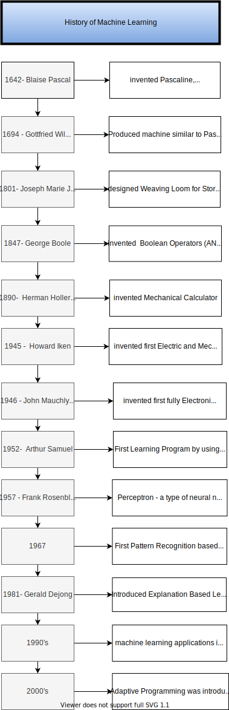

# SQL

**Structured Query Language**

### Part 1

- **SELECT**  is the most common statment used, and it allows us to retrieve information from a table.
- **What is Database**


- **DISTINCT** keyword operates on a column 

  ```sql
  SELECT DISTINCT column FROM table	
  ```


**Where Clause**
  - The where clause appears immediately after the from clause of the *SELECT* statement.
  - The conditions are used to filter the rows returned from the *SELECT* statment.
  - *PostgreSQL* provides a variety of standard

```SQL
--Select and WHERE Statment are really fundamental statments
--WHERE clause appears immediately after the FROM clause of the SELECT statment
--conditions are used to filter rows returned from the SELECT statement
--PostgresSQL provides a variety of standarad operators to construct the conditions.
--comparison operators 
--allows to compare the data
--Logical Operators , Allow us to combine 
-- SELECT name, choice FROM table
SELECT * FROM customer
WHERE first_name ='Jared';
```

```SQL
SELECT * FROM film
WHERE rental_rate >4 AND replacement_cost >= 19.99;

-----What does this query do?

SELECT title FROM film
WHERE rental_rate > 4 AND replacement_cost >= 19.99
AND rating='R';

----WHat will be output of this code---

SELECT COUNT(*) FROM film
WHERE rental_rate > 4 AND
replacement_cost >= 19.99
AND rating= 'R';


SELECT COUNT(*) FROM film
WHERE rating = 'R' OR rating ='PG-13'

-------
SELECT * FROM film
WHERE rating != 'R';

---Challenge No.1
--A Customer forgot their wallet at our store! We need to track down their email to inform them. What is the email for customer with name Nancy Thomas?
SELECT * FROM customer
LIMIT 3;


SELECT email FROM customer
WHERE first_name = 'Nancy' AND last_name = 'Thomas';

---Challenge No.2 
-- A customer wants  to know what the movie "Outlaw Hanky" is about .
-- Could you give them the description for the movie "Outlaw Hanky"

SELECT description FROM film
WHERE title = 'Outlaw Hanky';

--challenge No 3
-- A Customer is late on their movie return,
-- and we have mailed them a letter to their address at '259 Ipoh Drive' we should also call them on the phone to let them know .
-- Can you get the phone number for the customer who lives at '259 Ipoh Drive' ?
SELECT phone FROM address
WHERE address = '259 Ipoh Drive'

-- ORder By Statment
--You may have noticed that PostgresSQL sometimes returns the same request query results in a different order.
-- You can use ORDER BY to sort rows based on a column value, in either asscending or descending order.
-- Order by comes towards the end of the query
-- USE ASC to Ascending order and DESC to descending order
-- You can also use order bye on multiple columns
-- 

SELECT store_id,first_name,last_name FROM customer

ORDER BY store_id DESC , first_name DESC;


```

## Limit Function
- Limit key word allows us to limit the number of rows returned for a query.
- Useful for not wanting to return every single row in a table, but only view the top few rows to get an idea of the table layout.
- LIMIT also becomes useful in combination with **ORDER BY**
- **LIMIT** goes at the very end of the query request an is the last command to be executed.
-  Let's learn the basic syntax of LIMIT through some examples



<!-- please reduce the sige of rectangles width wise (vertically about 2/3  of the current size means two lines fit on it) export the diagram transparent -->